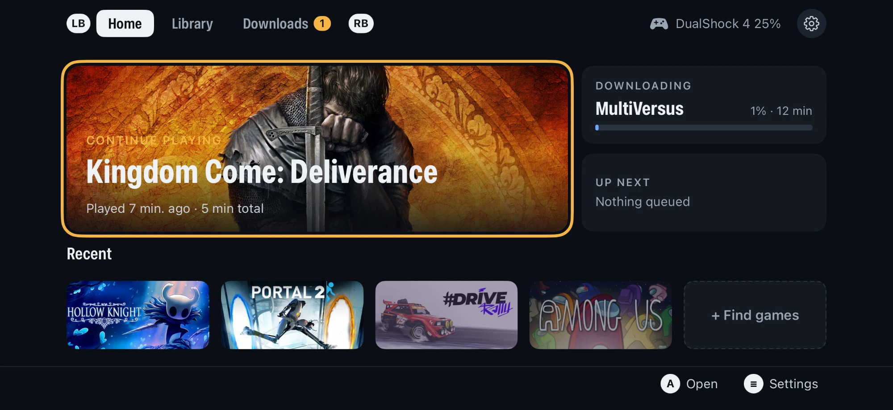
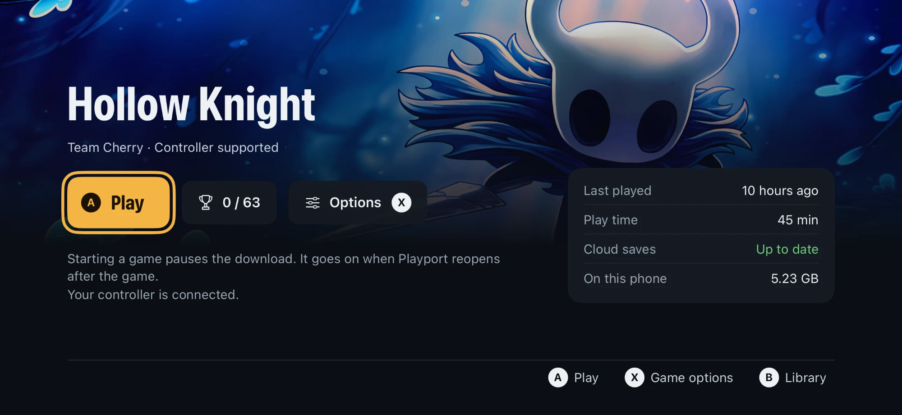

# Playport

**PC games on your iPhone. Natively, no streaming.**

[Website](https://playport.dev/) · [Download](https://github.com/playportdev/playport/releases) · [Architecture](docs/ARCHITECTURE.md)

Playport runs x86-64 Windows games on a stock, non-jailbroken iPhone. Install
a game from your library onto the phone, pick up a controller and press Play. The game runs on the phone's own CPU and GPU: no
PC, no cloud, no stream.

  

<table>
  <tr>
    <td width="50%"></td>
    <td width="50%"></td>
  </tr>
  <tr>
    <td align="center"><b>Library</b>: everything you own, installed or not</td>
    <td align="center"><b>Game page</b>: achievements, options, cloud saves</td>
  </tr>
</table>

<table>
  <tr>
    <td width="50%"></td>
    <td width="50%"></td>
  </tr>
  <tr>
    <td align="center"><b>The Witcher 3: Wild Hunt</b>: Direct3D 11 through DXMT, about 36 fps</td>
    <td align="center"><b>Hollow Knight</b>: the full 2736×1260, a steady 120 fps</td>
  </tr>
</table>

On an A19 Pro iPhone, iOS 27.0, with Metal's performance HUD.

## Quickstart

Playport is not on the App Store: you sideload the `.ipa` yourself.

1. Download the `.ipa` from [Releases](https://github.com/playportdev/playport/releases).
2. Sideload it onto your iPhone with your own Apple ID.
3. Turn on Developer Mode (Settings › Privacy & Security), and install
   LocalDevVPN from the App Store for JIT.
4. Open Playport and follow its first-run checklist: controller, pairing,
   LocalDevVPN and Steam.

A free Apple ID signs the app for seven days, so re-sign it once a week; your
games and saves stay on the phone.

## Why it's different

- **The real games, on the phone.** Wine, the FEX x86-64 translator and DXMT
  run together inside one iOS app, so a Windows `.exe` starts as it would on a PC.
  Direct3D 10 and 11 render straight to Metal through DXMT.
- **Vulkan on the iPhone, with KosmicKrisp.** An experimental Vulkan backend
  built on KosmicKrisp, Mesa's Vulkan driver for Apple's Metal, opens the door
  to Direct3D 12 through vkd3d-proton, and runs Direct3D 8 to 11 through DXVK.
  It is under active development.
- **More than a repackage.** Over a hundred of our own patches on top of
  Wine, FEX, DXMT, KosmicKrisp, vkd3d-proton and the Steam API emulator:
  performance and compatibility work (faster FEX translation for Unity games,
  lossless texture compression kept on in DXMT, geometry shaders and transform
  feedback in KosmicKrisp, feature level 12_0 in vkd3d-proton), dozens of bug
  fixes, and the diagnostics behind them. Each is a [reviewable patch](patches/)
  with the evidence for it.
- **On the latest upstreams.** Where Madeira stays on its own forks (Wine
  11.4, FEX 2607 and an older DXMT), Playport carries those ports forward
  onto current releases: WineHQ 11.18 with Valve's Proton 11 Wine on top,
  FEX 2609.1 and DXMT's main branch.
- **Your library.** Sign in to your store, browse what you own and download it
  straight to the phone. Steam works today; GOG and Epic Games are planned.
- **Made for a controller.** A landscape, gamepad-first interface and an
  in-game menu to pause, resume or quit. Controllers reach the game as XInput.
- **JIT built in.** The app carries its own JIT helper, so every Play works
  from the phone alone, after a one-time pairing.
- **No Mac.** The whole app is built, signed and installed from one Linux
  machine, with a free Apple ID.

## Release status and support

This is a development project, not a supported general-purpose Windows
compatibility layer or an approved public IPA distribution route. Hollow Knight
is the reference phone-test title; [`AGENTS.md`](AGENTS.md) and
[`docs/evidence/`](docs/evidence/) describe the checks. Games, Steam accounts and
pairing material are not supplied. Support is best-effort: redact account,
device, pairing and session data before sharing logs.

Public CI checks source and host tests only; it does not build, sign, install,
test on a phone or upload IPAs. A green check is not release approval. The
recipient source-bundle build and public signing workflow remain untested;
[`the release plan`](docs/plans/open-source-release.md) tracks the open gates.
The Linux pipeline uses Apple's SDK and ld64: a working build or Personal Team
signature does not settle Apple's SDK, provisioning, JIT or delivery terms.

## Good to know

- Playport is early and is tested on one phone: an A19 Pro iPhone (iPhone18,4) on iOS 27.0
  ([known-good versions](docs/DEVICE.md#known-good-ios-versions)).
- Games must be 64-bit. iOS leaves no room for 32-bit Windows programs.
- A free Apple ID signs apps for seven days, so refresh the app once a week
  (SideStore can do it on the phone). Your games and saves stay on the phone.
  Playport takes one of the free account's three app slots; its JIT helper takes
  no slot but is one of the ten App IDs the account may register a week.
- How it works: [architecture](docs/ARCHITECTURE.md), [building](docs/BUILDING.md),
  [the phone](docs/DEVICE.md), and the [decisions](docs/decisions/README.md) behind it.

## Local development

Start with `./pp test --quick` (Python and available host C tests, no Apple
account or phone) and `./pp --help`. For an app build, obtain the toolchains
in [`BUILDING.md`](docs/BUILDING.md), run `./pp setup`, then `./pp build`.
`./pp install` upgrades the paired phone in place; phone setup is in
[`DEVICE.md`](docs/DEVICE.md). A source checkout alone is not sufficient.
These are technical instructions, not permission to distribute: giving an IPA
to even one tester requires the source and notices in
[`DISTRIBUTION.md`](docs/DISTRIBUTION.md) and [`LICENSING.md`](docs/LICENSING.md).
[`AGENTS.md`](AGENTS.md) is the contributor guide.

## Credits

Playport is built on [willfaust/Madeira](https://github.com/willfaust/Madeira),
which first ran Wine, FEX-Emu and DXMT as one process on iOS. Every component
keeps its own licence; see [LICENSING.md](docs/LICENSING.md) and
[NOTICES.md](docs/NOTICES.md).

## Licence

GNU General Public License, version 3 or (at your option) any later version
([`LICENSE`](LICENSE)), with an additional permission under section 7 for
Playport's own code ([`LICENSE-EXCEPTION.md`](LICENSE-EXCEPTION.md)).

Copyright (C) 2026 The Playport authors.
