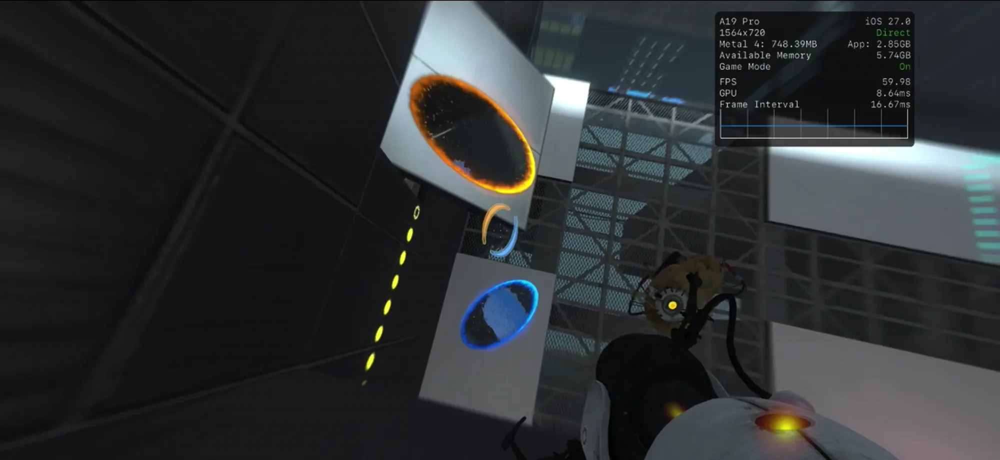
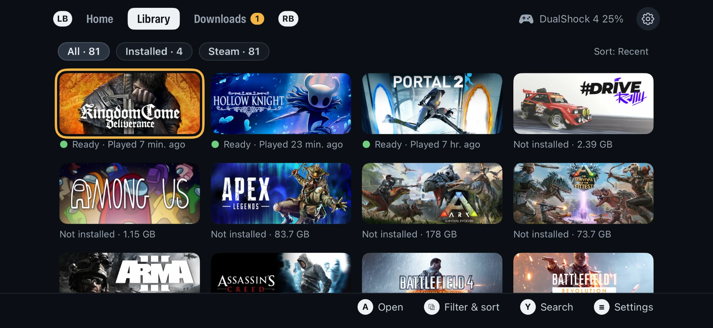
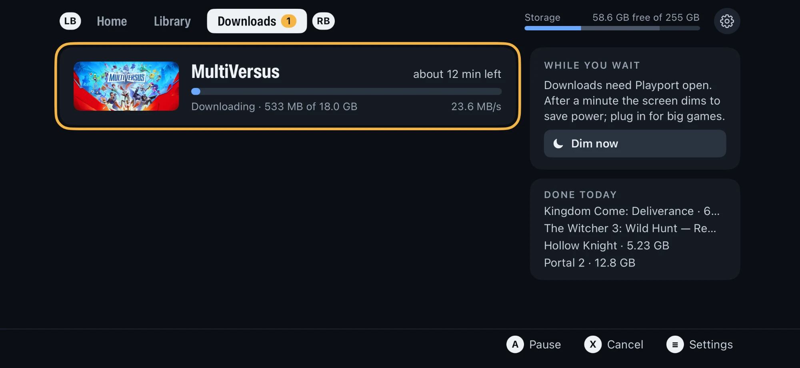
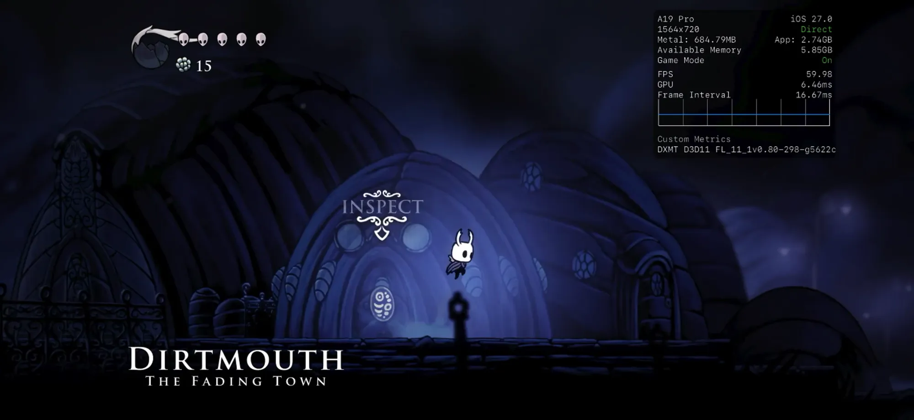
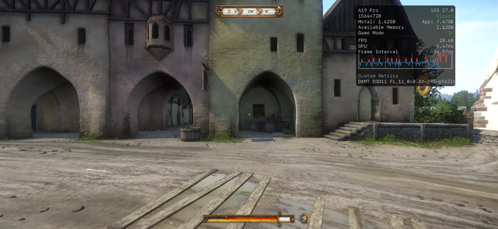
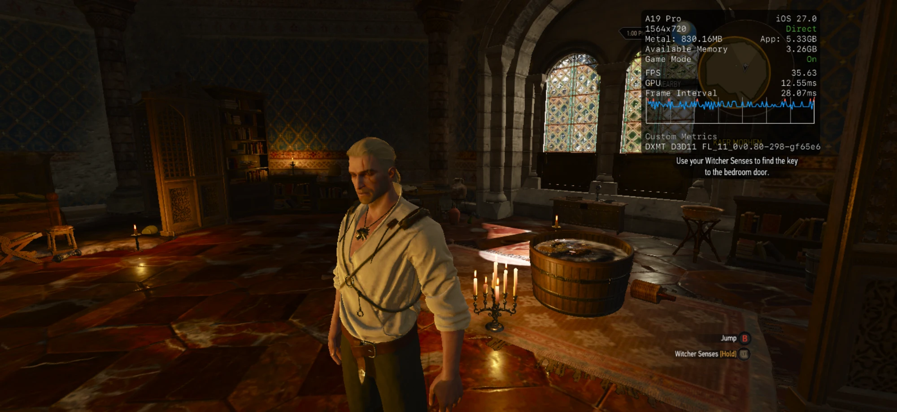
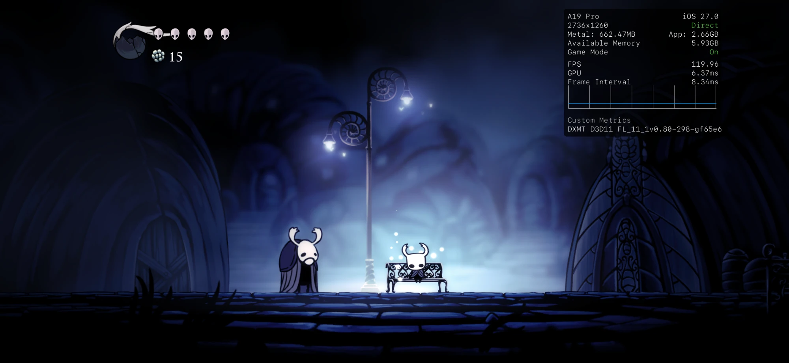

# Playport

**PC games on your iPhone. Natively, no streaming.**

[Website](https://playport.dev/) · [Download](https://github.com/playportdev/playport/releases) · [Architecture](docs/ARCHITECTURE.md)

Playport runs Windows games, 64-bit and now 32-bit, on a stock, non-jailbroken
iPhone. Install a game from your library onto the phone, pick up a controller
and press Play. The game runs on the phone's own CPU and GPU: no PC, no cloud,
no stream.

> **New in 0.3: 32-bit games.** 32-bit Windows games now run alongside 64-bit
> ones, with Direct3D 9 drawn on the iPhone's GPU through DXVK and KosmicKrisp.
> Portal 2 is the first: about 60 fps at 720p, with both portals, sound, a
> controller, saves and Steam Cloud. See the [release notes](docs/releases/0.3.0.md).

  
   <b>Portal 2</b>, a 32-bit Direct3D 9 game, at 60 fps through DXVK and KosmicKrisp. <b>Watch the uncut recording</b>: Home to Play to a test chamber (<a href="site/video/portal2.mp4">MP4</a>).

  

<table>
  <tr>
    <td width="50%"></td>
    <td width="50%"></td>
  </tr>
  <tr>
    <td align="center"><b>Library</b>: everything you own, installed or not</td>
    <td align="center"><b>Downloads</b>: straight from Steam onto the phone</td>
  </tr>
</table>

  
   <b>Watch the uncut recording</b>: Library to Play to Hollow Knight at 60 fps, then Quit back to Home (<a href="site/video/hollow-knight.mp4">MP4</a>).

  
   <b>Kingdom Come: Deliverance</b>: Rattay through DXMT's Direct3D 11, about 29 fps at 720 rows

<table>
  <tr>
    <td width="50%"></td>
    <td width="50%"></td>
  </tr>
  <tr>
    <td align="center"><b>The Witcher 3: Wild Hunt</b>: Direct3D 11 through DXMT, about 36 fps</td>
    <td align="center"><b>Hollow Knight</b>: the full 2736×1260, up to 120 fps</td>
  </tr>
</table>

On an A19 Pro iPhone, iOS 27.0, with Metal's performance HUD.

## Install

Playport is not on the App Store: you sideload the `.ipa` yourself, with your
own Apple ID (a free one works).

1. Download the `.ipa` from [Releases](https://github.com/playportdev/playport/releases).
   It is signed ad hoc (no certificate) and asks for Increased Memory Limit;
   your sideloader signs it for your iPhone.
2. Sideload it with a tool that keeps Increased Memory Limit (below). If the
   tool asks whether to keep app extensions, keep them: Playport's JIT helper
   is one.
3. Turn on Developer Mode (Settings › Privacy & Security), and install
   LocalDevVPN from the App Store for JIT.
4. Open Playport and follow its first-run checklist: pairing, LocalDevVPN,
   Memory and Steam. Memory has a green tick when the signature kept Increased
   Memory Limit.

A free Apple ID signs the app for seven days, so re-sign it once a week; your
games and saves stay on the phone.

### Which sideloaders keep the memory limit

iOS closes an app that uses more memory than its limit, and Playport's JIT
memory, the runtime and the game all share that one limit. With Increased
Memory Limit our 12 GB test iPhone gives Playport 6 to 8 GB; without it an
8 GB iPhone gives about 3.3 GB, and Playport will not start a game known to
need more. The `.ipa` asks for it, but iOS grants it only when the sideloader
also turns the capability on for the app's App ID at Apple, and not every
sideloader does.

| Sideloader | Keeps Increased Memory Limit |
| --- | --- |
| AltStore Classic 2.2 or later | yes |
| [Impactor](https://github.com/khcrysalis/PlumeImpactor), from a computer | yes |
| Xcode with a Personal Team | yes |
| SideStore 0.7.0, free Apple ID | **no**: do the [one-time fix below](#sidestore-when-memory-has-no-tick) |
| Sideloadly and others | check the Memory step |

Whatever you use, Playport tells you: the first-run checklist's **Memory**
step has a green tick, and Settings › Setup check shows Increased Memory Limit
On. If it is Off, the step's **How to fix** shows what to do; **Not now** puts
it off, and smaller games still play.

### SideStore: when Memory has no tick

SideStore asks for Increased Memory Limit but does not turn it on for a free
Apple ID ([SideStore#1616](https://github.com/SideStore/SideStore/issues/1616)),
so Playport's App ID gets it once with GetMoreRam:

1. Install Playport with SideStore as usual, so its App ID exists.
2. Sideload [GetMoreRam](https://github.com/hugeBlack/GetMoreRam) and, in its
   Settings, sign in with the same Apple ID SideStore uses.
3. On its **App IDs** page tap **Refresh**, tap Playport's App ID, then **Add
   Increased Memory Limit**.
4. Reinstall Playport from SideStore. It upgrades in place: your games and
   saves stay.
5. Open Playport: the Memory step has its tick, and Settings › Setup check
   shows Increased Memory Limit On.

The capability stays on the App ID, so SideStore's weekly refresh keeps it. If
the tick ever goes away, repeat steps 3 and 4. GetMoreRam takes one of a free
Apple ID's three app slots; delete it afterwards to free the slot.

## How Playport differs from Madeira

Playport is built on [willfaust/Madeira](https://github.com/willfaust/Madeira),
the research project that first ran Wine, FEX-Emu and DXMT as one process on
iOS. Madeira proved it could be done; Playport turns it into an app you can
play with. In plain points:

| | Madeira | Playport |
| --- | --- | --- |
| **32-bit games** | x86-64 only | x86-64 **and 32-bit x86**: each 32-bit game gets its own 4 GB window, Portal 2 plays at about 60 fps |
| **Graphics** | Direct3D 11 through DXMT | DXMT for Direct3D 10 and 11, **plus Vulkan through KosmicKrisp**: Direct3D 9 through DXVK, Direct3D 12 through vkd3d-proton (experimental), chosen per game automatically |
| **Upstreams** | its own forks: Wine 11.4, FEX 2607, an older DXMT | the latest releases: WineHQ 11.18 with Valve's Proton 11 Wine, FEX 2609.1, DXMT main, Mesa main |
| **Getting games** | launches set up per test title | sign in to Steam, browse your library, download to the phone; cloud saves and achievements |
| **The app** | a touch-driven test bench; controllers and touch controls reach the game | a landscape, gamepad-first app with an in-game menu to pause, resume or quit |
| **JIT** | a separate debugger app attaches for every launch | a JIT helper built into the app, after a one-time pairing |
| **Building** | Xcode on a Mac | one Linux machine and a free Apple ID; no Mac anywhere |
| **Getting it** | build it yourself | a ready `.ipa` on [Releases](https://github.com/playportdev/playport/releases), with the complete source of that exact build |

Behind these are over 170 of our own [patches](patches/) on Wine, FEX, DXMT,
KosmicKrisp, vkd3d-proton and the Steam API emulator: the 32-bit runtime,
performance work (faster FEX translation for Unity games, x87 math at native
precision, lossless texture compression kept on in DXMT, geometry shaders in
KosmicKrisp), dozens of bug fixes, and the diagnostics behind them. Each one is
a reviewable patch with the evidence for it.

## Release status and support

This is a development project, not a supported general-purpose Windows
compatibility layer or an approved public IPA distribution route. Hollow Knight
is the reference phone-test title; [`AGENTS.md`](AGENTS.md) and
[`docs/evidence/`](docs/evidence/) describe the checks. Games, Steam accounts and
pairing material are not supplied. Support is best-effort: redact account,
device, pairing and session data before sharing logs.

Public CI checks source and host tests only; it does not build, sign, install,
test on a phone or upload IPAs. A green check is not release approval. The
recipient source-bundle build and public signing workflow remain untested;
[`the release plan`](docs/plans/open-source-release.md) tracks the open gates.
The Linux pipeline uses Apple's SDK and ld64: a working build or Personal Team
signature does not settle Apple's SDK, provisioning, JIT or delivery terms.

## Good to know

- Playport is early and is tested on one phone: an A19 Pro iPhone (iPhone18,4) on iOS 27.0
  ([known-good versions](docs/DEVICE.md#known-good-ios-versions)).
- 32-bit games are new: Portal 2 is the only one tested so far. They run on
  the Vulkan backend, which is experimental.
- A free Apple ID signs apps for seven days, so refresh the app once a week
  (SideStore can do it on the phone, after the one-time
  [memory step](#sidestore-when-memory-has-no-tick)). Your games and saves stay on the phone.
  Playport takes one of the free account's three app slots; its JIT helper takes
  no slot but is one of the ten App IDs the account may register a week.
- How it works: [architecture](docs/ARCHITECTURE.md), [building](docs/BUILDING.md),
  [the phone](docs/DEVICE.md), and the [decisions](docs/decisions/README.md) behind it.

## Local development

Start with `./pp test --quick` (Python and available host C tests, no Apple
account or phone) and `./pp --help`. For an app build, obtain the toolchains
in [`BUILDING.md`](docs/BUILDING.md), run `./pp setup`, then `./pp build`.
`./pp install` upgrades the paired phone in place; phone setup is in
[`DEVICE.md`](docs/DEVICE.md). A source checkout alone is not sufficient.
These are technical instructions, not permission to distribute: giving an IPA
to even one tester requires the source and notices in
[`DISTRIBUTION.md`](docs/DISTRIBUTION.md) and [`LICENSING.md`](docs/LICENSING.md).
[`AGENTS.md`](AGENTS.md) is the contributor guide.

## Credits

Playport is built on [willfaust/Madeira](https://github.com/willfaust/Madeira),
which first ran Wine, FEX-Emu and DXMT as one process on iOS. Every component
keeps its own licence; see [LICENSING.md](docs/LICENSING.md) and
[NOTICES.md](docs/NOTICES.md).

## Licence

GNU General Public License, version 3 or (at your option) any later version
([`LICENSE`](LICENSE)), with an additional permission under section 7 for
Playport's own code ([`LICENSE-EXCEPTION.md`](LICENSE-EXCEPTION.md)).

Copyright (C) 2026 The Playport authors.
